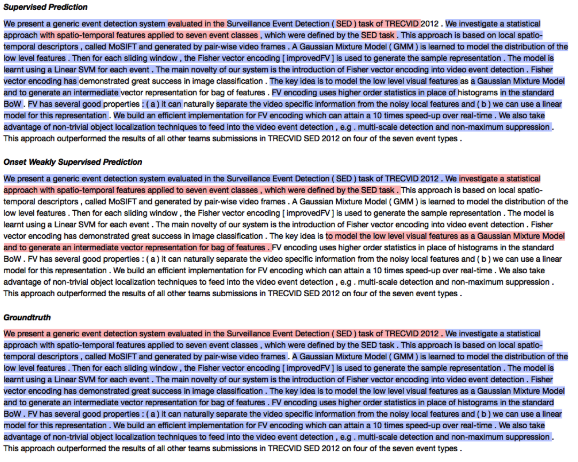

# Automated abstract segmentation

## Task definition 

This task examines effective weak-supervision approach to segment abstracts (into sections of *background*, *problem*, *mechanism*, *finding*, etc.). It serve as the pre-processing technique to support analogical thinking for scientific researchers to generate new ideas.

We illustrate the segmentation (red as problem section, blue as mechanism section) below, compared with ground-truth segmentation from human annotators, and supervised segmentation from a labeled dataset in [SOLVENT paper](http://joelchan.me/assets/pdf/2018-cscw-schema-highlighter.pdf).

## Lessons learned

### Can weak supervision support segmentation of abstracts (i.e., purpose/mechanism)?

To some extent. First, one requirement is to segment by word (as the unit), not clause or sentence. We design labeling functions that considers a word as a candidate to be the <START> of a segment. The labeling function writes rules about the word information and surrounding context. Second, are more successful to identify purpose segment, less successful with mechanism segment (i.e. supervised models still seem to be substantially better).

### Do word-level segmentation accuracy have a high impact the analogical matching (finding true analogical pairs) accuracy? 

No, even if the word-level segmentation accuracy is low at a face value (sub-0.5, ~0.3-0.5), is is still possible to use the segmentation and do pair-wise analogical match, that finds true analogical pairs. 

This is because some word-level errors are not affecting match. It is possible to have low label accuracy on template words (e.g. "This paper proposes") but still capture the most important substantial information bits.

### Why weak-onset segments better than supervised for purpose section, and weak-onset segments worse than supervised for mechanism section?

This is because we could easily write rules for <START> words in purpose section (e.g. "for X-ing", "to verb.", etc.) and know when the section stops. It is harder to write <START> rules for mechanism beside "using", "... approach is ...", and also harder to know when the section stops.

### Is Snorkel a good tool to do weak supervision?

Not necessarily. This is because our weak supervision rules that identify segmentation <START> are mostly mutual indepdent. There is little room/necessity to denoise these rules (labeling function). Denoising turns out to be Snorkel’s advantages, but is hardly here. 
  
Another downside of snorkel is the costs (computational efficiency, transparency of implementation). If we had to do it again, we would probably have better spent our time by validating this key assumption first, and if it turned out to false, explore weak supervision outside of the Snorkel framework

### Any final note?

Weak supervision to segment abstracts could be an effective approach; but does not have to be within Snorkel. 

